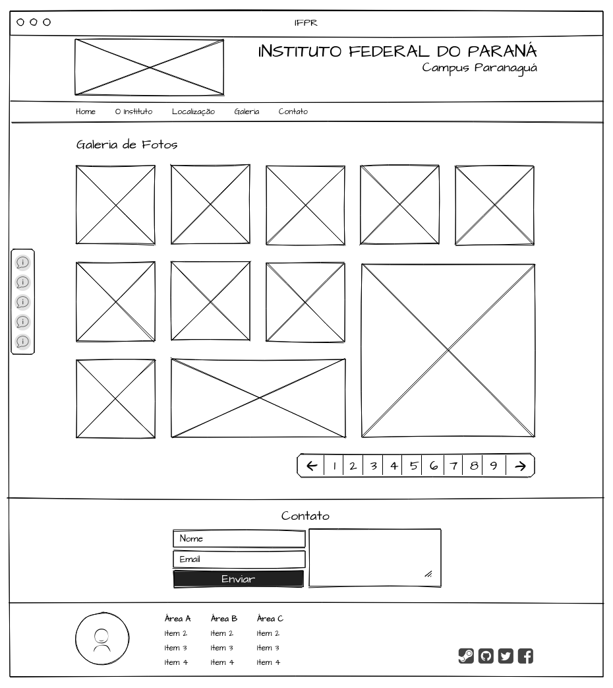

# Atividade 5 - Layout com Flex e Grid

## Equipe

- Bruna Loyola
- Helena Maia

## Descrição da Atividade

Considerando o aprendido sobre layouts, faça uma galeria de fotos na sua página do IFPR, adaptando ao novo layout apresentado abaixo.

- Utilizar **Flex**
- Utilizar **Grid**
- Utilizar **display: block;** quando não for necessário "criar complicação" com Flex ou Grid
- Utilizar **position: fixed;**

